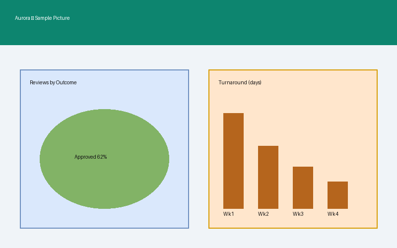
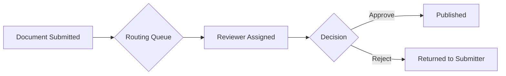

# Markdown Feature Showcase

A demo of every object type supported by the md-editor-v3 syntax
(https://imzbf.github.io/md-editor-v3/en-US/syntax).

## Headings

# H1
## H2
### H3
#### H4
##### H5
###### H6

## Emphasis

**bold text**, _italic text_, ~~strikethrough~~, <u>underline</u>, plain text.

Combined: **_bold and italic_**, **~~bold and strikethrough~~**.

Superscript: text^[1]^  Subscript: text~[2]~

## Blockquote

> A single-line blockquote.
>
> A blockquote with multiple paragraphs.
> > A nested blockquote.

## Lists

Unordered:

- Item one
- Item two
  - Nested item
  - Another nested item
- Item three

Ordered:

1. First step
2. Second step
   1. Sub-step A
   2. Sub-step B
3. Third step

Task list:

- [x] Write project charter
- [x] Finish wireframes
- [ ] Finalize API contract
- [ ] Run pilot with 3 teams

## Links and Images

[ownCloud Infinite Scale](https://owncloud.dev/ocis/ "oCIS developer docs")



Reference-style link: [oCIS repo][ocis-repo]

[ocis-repo]: https://github.com/owncloud/ocis "owncloud/ocis on GitHub"

## Code

Inline code: `const x = 42`

Block code:

```javascript
function reviewDecision(status) {
  return status === 'approved' ? '✅' : '❌'
}
```

Code tabs (same snippet, two languages):

```javascript [id:js]
console.log('Hello from JavaScript')
```

```python [id:py]
print("Hello from Python")
```

Foldable code block (collapsed by default):

```json ::close
{
  "id": "aurora",
  "phase": "development",
  "reviewers": ["alice", "bob"]
}
```

## Table

| Phase | Owner | Status |
|---|:---:|---:|
| Discovery | Product | Done |
| Design | Design | Done |
| Development | Engineering | In Progress |
| Pilot | Product | Not Started |

## Horizontal Rule

---

## Math (KaTeX)

Inline math: the review SLA is $t_{review} \leq 24h$.

Block math:

$$
\text{Turnaround} = \frac{\sum_{i=1}^{n} (t_{decision,i} - t_{submitted,i})}{n}
$$

## Mermaid Diagram



See `Mermaid-Diagrams.md` in this folder for the full diagram-type gallery.

## Alerts / Admonitions

!!! note Note
A plain note callout.
!!!

!!! tip Tip
Use the routing queue filter to focus on your own team's documents.
!!!

!!! warning Warning
Rejected documents are not automatically resubmitted.
!!!

!!! danger Danger
Do not delete the audit log table in production.
!!!

!!! success Success
Pilot rollout completed with zero SLA breaches.
!!!

!!! info Info
The API reference lives in `05-Documentation/API-Reference.md`.
!!!

!!! bug Bug
Mobile layout currently clips the decision panel on small screens.
!!!

!!! example Example
See `sample-request.json` in the API reference for a full payload example.
!!!

!!! question Question
Should bulk-approve be limited to low-risk documents only?
!!!

!!! quote Quote
"Move the decision, not the document." — Aurora design principle
!!!

!!! hint Hint
Keyboard shortcut `g` then `r` jumps to the review queue.
!!!

!!! caution Caution
Changing the routing rules affects in-flight reviews immediately.
!!!

!!! error Error
`413 Payload Too Large` — attachment exceeds the 25MB limit.
!!!

!!! attention Attention
Auth App Service must be enabled for App Tokens to work.
!!!

!!! abstract Abstract
This document showcases every markdown object type used across the Aurora
demo project space.
!!!

!!! failure Failure
Build #482 failed: missing `WORKFLOWS_ENCRYPTION_KEY`.
!!!
