# Mermaid Diagram Gallery

One example of each standard Mermaid.js diagram type, themed around the Aurora
review workflow.

## Flowchart

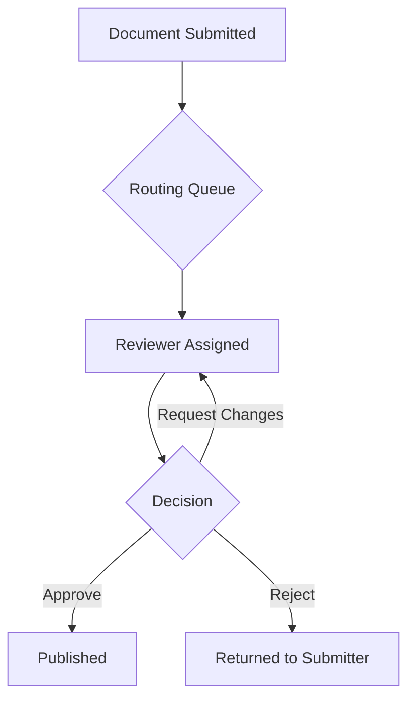

## Sequence Diagram

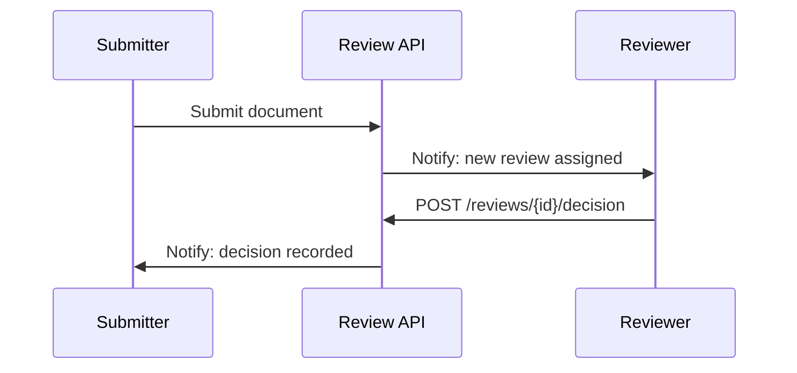

## Class Diagram

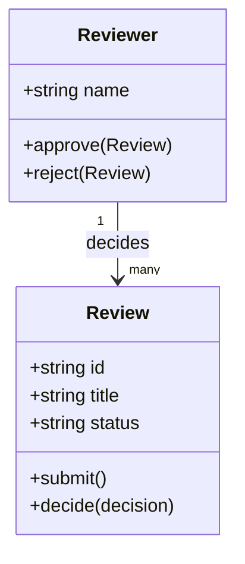

## State Diagram

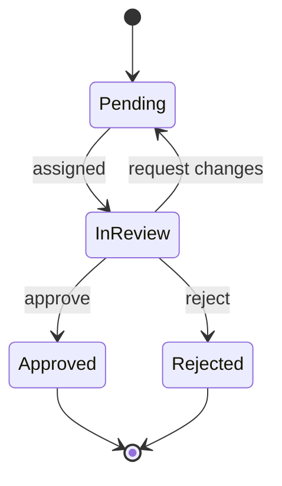

## Entity Relationship Diagram

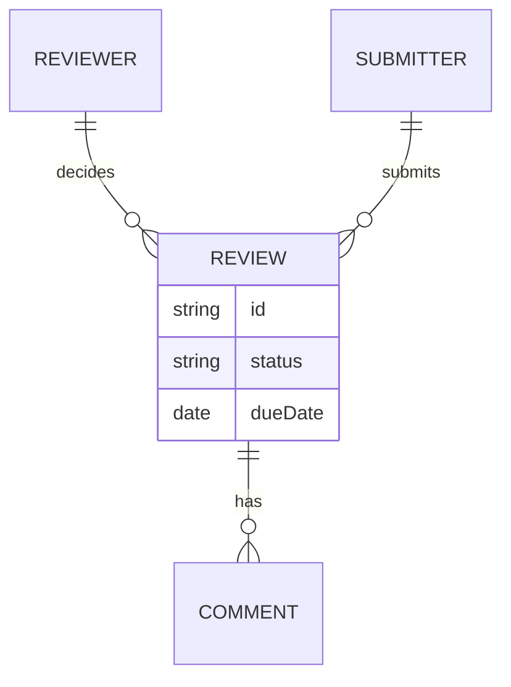

## User Journey

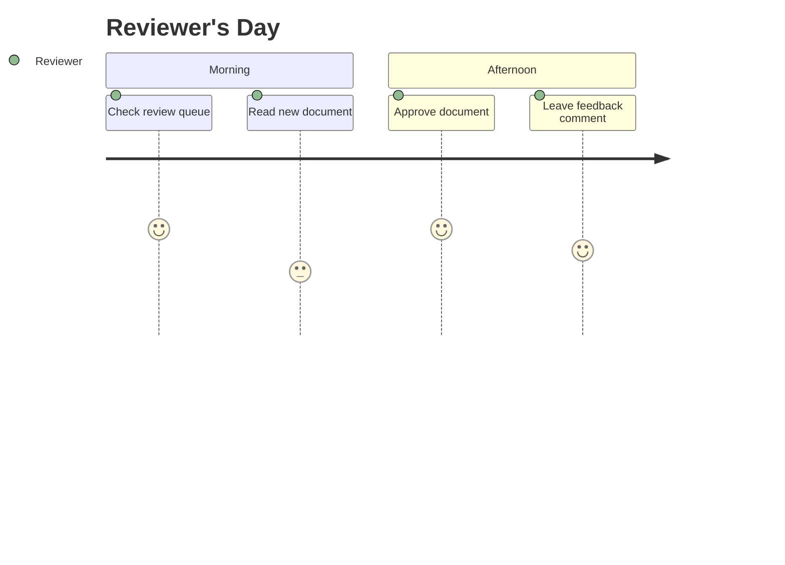

## Gantt Chart

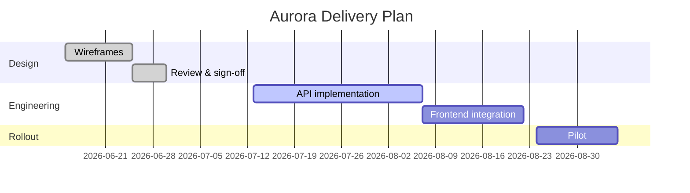

## Pie Chart

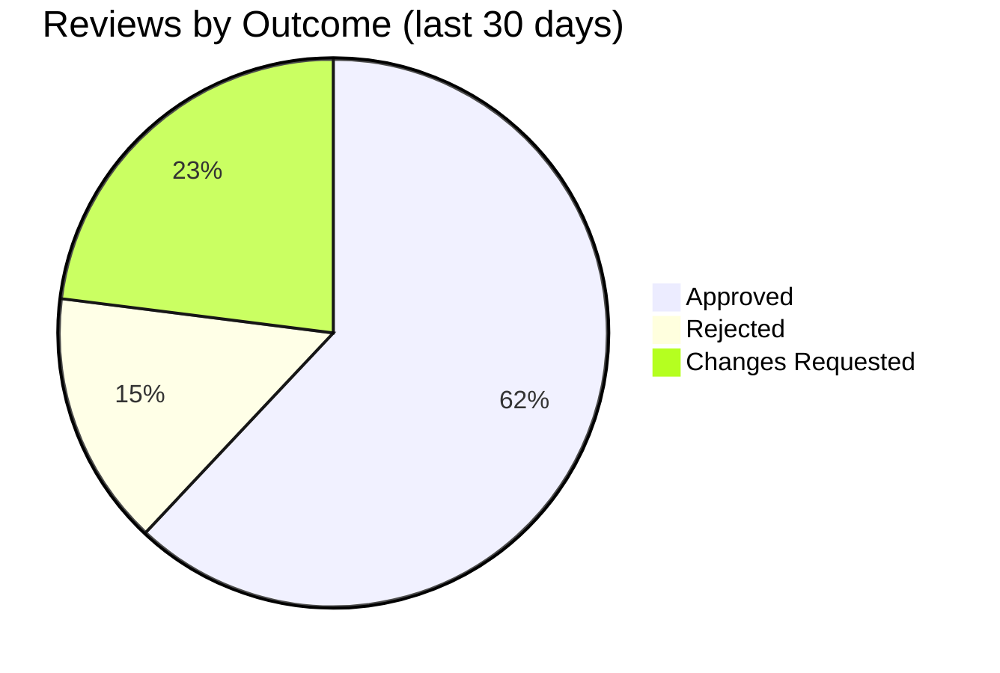

## Quadrant Chart

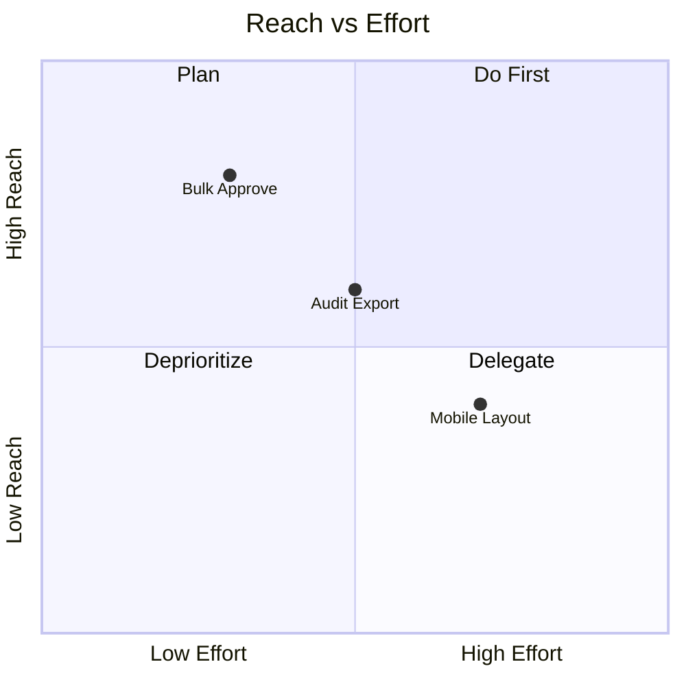

## Requirement Diagram

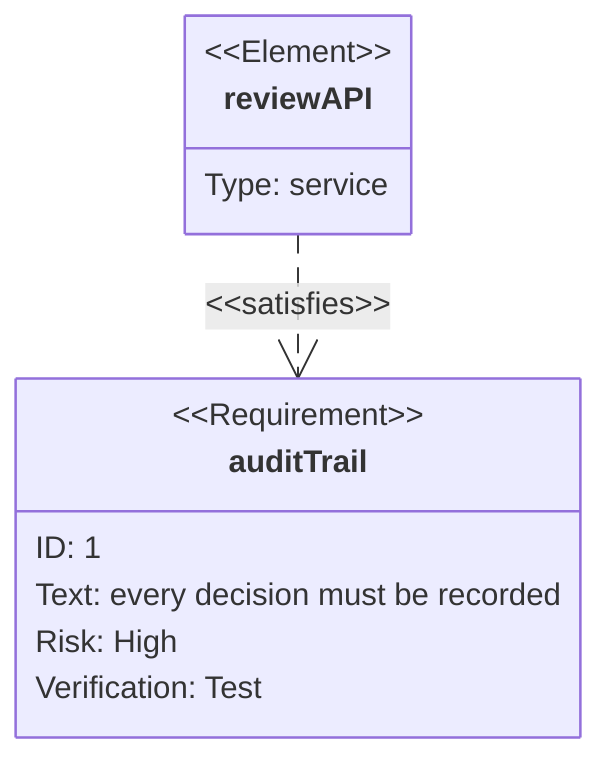

## Git Graph

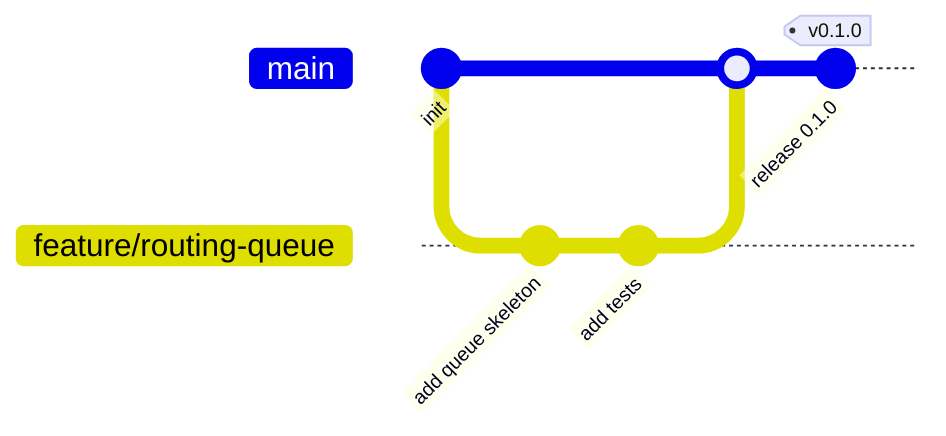

## Mindmap

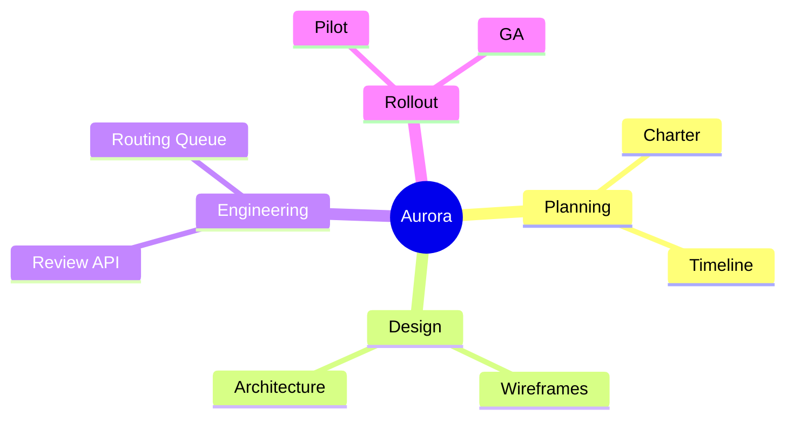

## Timeline

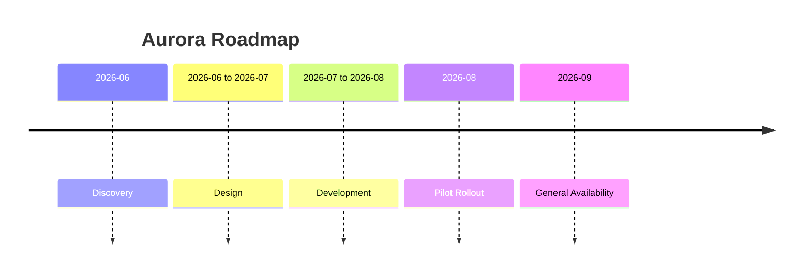
