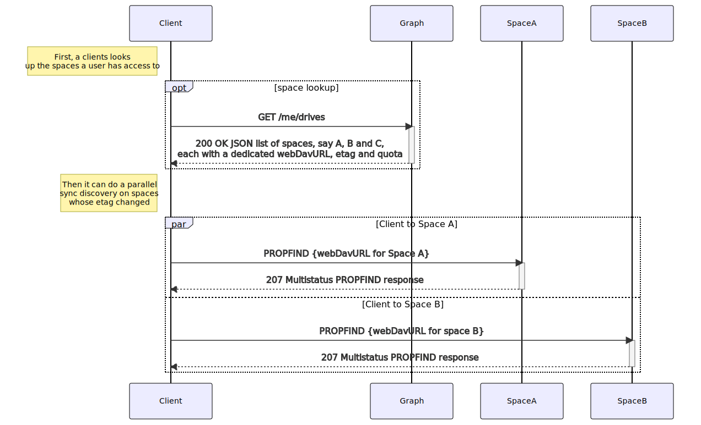

## Abstract

The graph service provides the Graph API which is a RESTful web API used to access Infinite Scale resources. It is inspired by the [Microsoft Graph API](https://learn.microsoft.com/en-us/graph/use-the-api) and can be used by clients or other services or extensions.

## Table of Contents

* [Manual Filters](#manual-filters)
* [Sequence Diagram](#sequence-diagram)
* [Example Yaml Config](#example-yaml-config)

## Manual Filters

Using the API, you can manually filter like for users. See the [Libre Graph API](https://owncloud.dev/libre-graph-api/#/users/ListUsers) for examples in the [developer documentation](https://owncloud.dev). Note that you can use `and` and `or` to refine results.

## Sequence Diagram

The following image gives an overview of the scenario when a client requests to list available spaces the user has access to. To do so, the client is directed with his request automatically via the proxy service to the graph service.
<!-- referencing: https://github.com/owncloud/ocis/pull/3816 ([docs-only] add client protocol overview) -->

## Example Yaml Config





