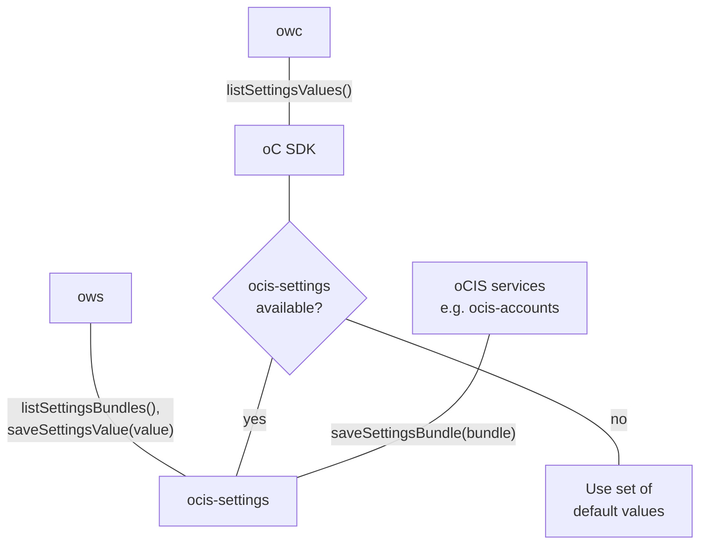

# Settings

The "settings" service provides functionality for other services to register
new settings within oCIS. It is also responsible for storing the respective settings
values as well.

The "settings" service is currently used for
* managing the users' "profile" settings. E.g. the language and the Email notification
  settings
* managing the possible user roles and their respecitve permssions
* managing the assignment of roles to users

The "settings" service supports two different backends for persisting the data. The backend
can be set using `SETTINGS_STORE_TYPE` environment variable. Supported values are:

* `metadata`: The default. This backend persists the settings data via the `storeage-system` service
* `filesystem`: This backend persists the settings data in a directory on the local filesystem.
  The directory can be configured with `SETTINGS_DATA_PATH`. This backend is not suitable for running
  multiple intances of the `settings` service in a scale-out deployment. It should be considered
  deprecated.

<!--- Note: The diagramm is outdate, leaving it here for a future rework
The diagram shows how the settings service integrates into oCIS:

-->

The diagram shows how the settings service integrates into oCIS:

## Settings Management

oCIS services can register *settings bundles* with the ocis-settings service.

## Settings Usage

Services can query ocis-settings for *settings values* of a user.
