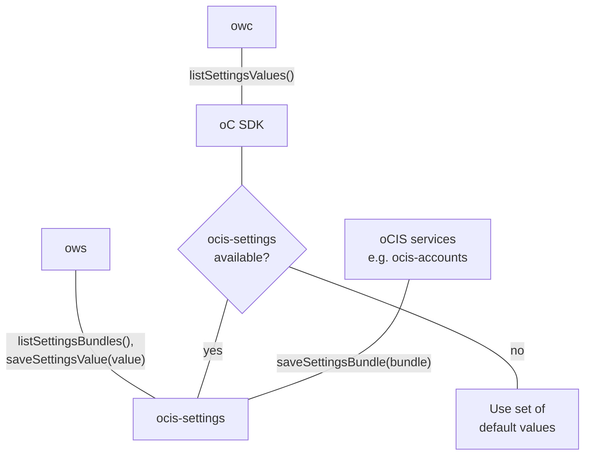

# Settings

The "settings" service provides functionality for other services to register
new settings within oCIS. It is also responsible for storing the respective settings
values as well.

The "settings" service is currently used for
* managing the users' "profile" settings. E.g. the language and the Email notification
  settings
* managing the possible user roles and their respecitve permssions
* managing the assignment of roles to users

The "settings" service supports two different backends for persisting the data. The backend
can be set using `SETTINGS_STORE_TYPE` environment variable. Supported values are:

* `metadata`: The default. This backend persists the settings data via the `storeage-system` service
* `filesystem`: This backend persists the settings data in a directory on the local filesystem.
  The directory can be configured with `SETTINGS_DATA_PATH`. This backend is not suitable for running
  multiple intances of the `settings` service in a scale-out deployment. It should be considered
  deprecated.

<!--- Note: The diagramm is outdate, leaving it here for a future rework
The diagram shows how the settings service integrates into oCIS:

The diagram shows how the settings service integrates into oCIS:

-->

## Caching

When using the `SETTINGS_STORE_TYPE=metadata` The `settings` services, caches
the results of queries to the `system-storage` for providing faster responses.
The store used for the cache can be configured using the `SETTINGS_CACHE_STORE`
environment variable. Possible stores are:
  -   `memory`: Basic in-memory store and the default.
  -   `redis`: Stores metadata in a configured Redis cluster.
  -   `redis-sentinel`: Stores metadata in a configured Redis Sentinel cluster.
  -   `etcd`: Stores metadata in a configured etcd cluster.
  -   `nats-js`: Stores metadata using the key-value-store feature of [nats jetstream](https://docs.nats.io/nats-concepts/jetstream/key-value-store)
  -   `noop`: Stores nothing. Useful for testing. Not recommended in production environments.

1.  Note that in-memory stores are by nature not reboot-persistent.
2.  Though usually not necessary, a database name can be configured for event
    stores if the event store supports this. Generally not applicable for
    stores of type `in-memory`, `redis` and `redis-sentinel`. These settings
    are blank by default which means that the standard settings of the
    configured store apply.
3.  The `settings` service can be scaled if not using `in-memory` stores and
    the stores are configured identically over all instances.
4.  When using `redis-sentinel`, the Redis master to use is configured via
    `SETTINGS_CACHE_STORE_NODES` in the form of
    `<sentinel-host>:<sentinel-port>/<redis-master>` like
    `10.10.0.200:26379/mymaster`.

## Settings Management

oCIS services can register *settings bundles* with the ocis-settings service.

## Settings Usage

Services can query ocis-settings for *settings values* of a user.
