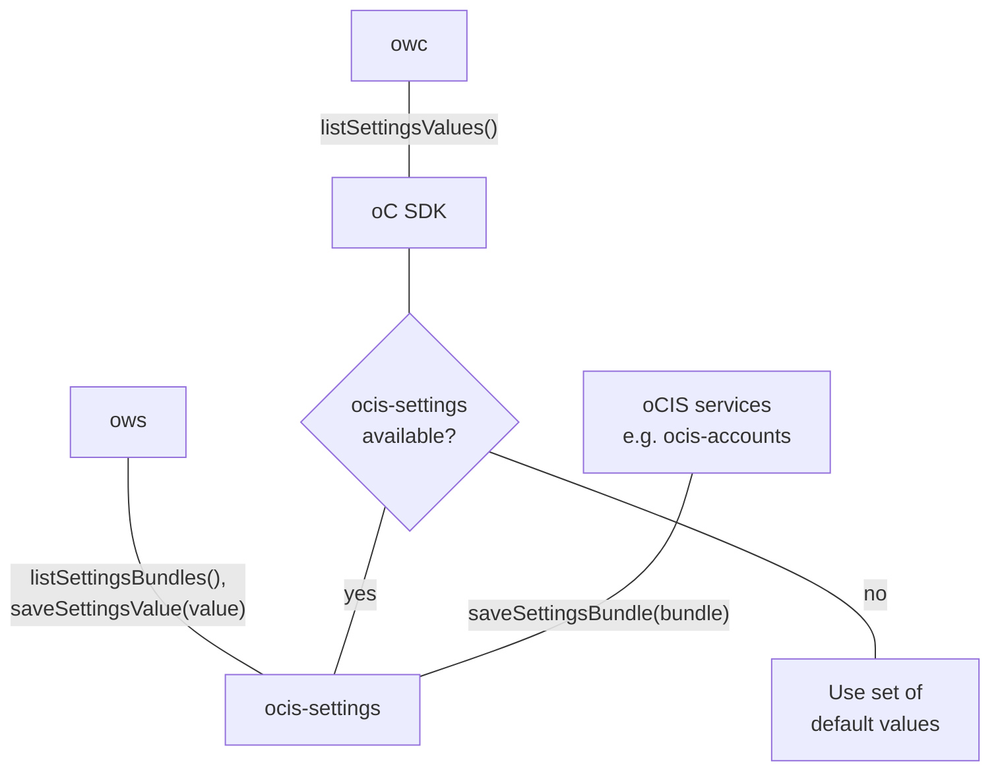

<!-- Do not edit this file, it is autogenerated. Edit the service README.md instead -->

## Abstract


The `settings` service provides functionality for other services to register new settings as well as storing and retrieving the respective settings' values.


## Table of Contents

* [Settings Managed](#settings-managed)
* [Caching](#caching)
* [Settings Management](#settings-management)
* [Settings Usage](#settings-usage)
* [Service Accounts](#service-accounts)
* [Default Language](#default-language)
* [Custom Roles](#custom-roles)
* [Example Yaml Config](#example-yaml-config)

## Settings Managed

The settings service is currently used for managing the:

*   users' `profile` settings like the language and the email notification settings,
*   possible user roles and their respective permissions,
*   assignment of roles to users.

As an example, user profile settings that can be changed in the Web UI must be persistent.

The settings service persists the settings data via the `storage-system` service.

<!--- Note: The diagramm is outdate, leaving it here for a future rework
The diagram shows how the settings service integrates into oCIS:

The diagram shows how the settings service integrates into oCIS:


-->

## Caching

The `settings` service caches the results of queries against the storage backend to provide faster responses. The content of this cache is independent of the cache used in the `storage-system` service as it caches directory listing and settings content stored in files.

The store used for the cache can be configured using the `SETTINGS_CACHE_STORE` environment variable. Possible stores are:
  -   `memory`: Basic in-memory store and the default.
  -   `redis-sentinel`: Stores data in a configured Redis Sentinel cluster.
  -   `nats-js-kv`: Stores data using key-value-store feature of [nats jetstream](https://docs.nats.io/nats-concepts/jetstream/key-value-store)
  -   `noop`: Stores nothing. Useful for testing. Not recommended in production environments.
  -   `ocmem`: Advanced in-memory store allowing max size. (deprecated)
  -   `redis`: Stores data in a configured Redis cluster. (deprecated)
  -   `etcd`: Stores data in a configured etcd cluster. (deprecated)
  -   `nats-js`: Stores data using object-store feature of [nats jetstream](https://docs.nats.io/nats-concepts/jetstream/obj_store) (deprecated)

Other store types may work but are not supported currently.

Note: The service can only be scaled if not using `memory` store and the stores are configured identically over all instances!


Note that if you have used one of the deprecated stores, you should reconfigure to one of the supported ones as the deprecated stores will be removed in a later version.

Store specific notes:
  -   When using `redis-sentinel`, the Redis master to use is configured via e.g. `OCIS_CACHE_STORE_NODES` in the form of `<sentinel-host>:<sentinel-port>/<redis-master>` like `10.10.0.200:26379/mymaster`.
  -   When using `nats-js-kv` it is recommended to set `OCIS_CACHE_STORE_NODES` to the same value as `OCIS_EVENTS_ENDPOINT`. That way the cache uses the same nats instance as the event bus.
  -   When using the `nats-js-kv` store, it is possible to set `OCIS_CACHE_DISABLE_PERSISTENCE` to instruct nats to not persist cache data on disc.

## Settings Management

Infinite Scale services can register *settings bundles* with the settings service.

## Settings Usage

Services can set or query Infinite Scale *setting values* of a user from settings bundles.

## Service Accounts

The settings service needs to know the IDs of service accounts but it doesn't need their secrets. They can be configured using the `SETTINGS_SERVICE_ACCOUNTS_IDS` envvar. When only using one service account `OCIS_SERVICE_ACCOUNT_ID` can also be used. All configured service accounts will get a hidden 'service-account' role. This role contains all permissions the service account needs but will not appear calls to the list roles endpoint. It is not possible to assign the 'service-account' role to a normal user.

## Default Language

The default language can be defined via the `OCIS_DEFAULT_LANGUAGE` environment variable. If this variable is not defined, English will be used as default. The value has the ISO 639-1 format ("de", "en", etc.) and is limited by the list supported languages. This setting can be used to set the default language for notification and invitation emails.

Important developer note: the list of supported languages is at the moment not easy defineable, as it is the minimum intersection of languages shown in the WebUI and languages defined in the ocis code for the use of notifications and userlog. Even more, not all languages where there are translations available on transifex, are available in the WebUI respectively for ocis notifications, and the translation rate for existing languages is partially not that high. You will see therefore quite often English default strings though a supported language may exist and was selected.

The `OCIS_DEFAULT_LANGUAGE` setting impacts the `notification` and `userlog` services and the WebUI. Note that translations must exist for all named components to be presented correctly.

*   If  `OCIS_DEFAULT_LANGUAGE` **is not set**, the expected behavior is:
    *   The `notification` and `userlog` services and the WebUI use English by default until a user sets another language in the WebUI via _Account -> Language_.
    *    If a user sets another language in the WebUI in _Account -> Language_, then the `notification` and `userlog` services and WebUI use the language defined by the user. If no translation is found, it falls back to English.

*   If  `OCIS_DEFAULT_LANGUAGE` **is set**, the expected behavior is:
    *   The `notification` and `userlog` services and the WebUI use `OCIS_DEFAULT_LANGUAGE`  by default until a user sets another language in the WebUI via _Account -> Language_.
    *   If a user sets another language in the WebUI in _Account -> Language_, the `notification` and `userlog` services and WebUI use the language defined by the user. If no translation is found, it falls back to `OCIS_DEFAULT_LANGUAGE` and then to English.

## Custom Roles

It is possible to replace the default ocis roles (`admin`, `user`) with custom roles that contain custom permissions. One can set `SETTINGS_BUNDLES_PATH` to the path of a `json` file containing the new roles.

Role Example:
```json
[
    {
        "id": "38071a68-456a-4553-846a-fa67bf5596cc", // ID of the role. Recommendation is to use a random uuidv4. But any unique string will do.
        "name": "user-light",                         // Internal name of the role. This is used by the system to identify the role. Any string will do here, but it should be unique among the other roles.
        "type": "TYPE_ROLE",                          // Always use `TYPE_ROLE`
        "extension": "ocis-roles",                    // Always use `ocis-roles`
        "displayName": "User Light",                  // DisplayName of the role used in webui
        "settings": [
        ],                                            // Permissions attached to the role. See Details below.
        "resource": {
            "type": "TYPE_SYSTEM"                     // Always use `TYPE_SYSTEM`
        }
    }
]
```

To create custom roles:
* Copy the role example to a `json` file.
* Change `id`, `name`, and `displayName` to your liking.
* Copy the desired permissions from the `user-all-permissions` example below to the `settings` array of the role.
* Set the `SETTINGS_BUNDLE_PATH` envvar to the path of the json file and start ocis

Example File:
```json
[
    {
        "id": "38071a68-456a-4553-846a-fa67bf5596cc",
        "name": "user-1-permission",
        "type": "TYPE_ROLE",
        "extension": "ocis-roles",
        "displayName": "User with one permission only",
        "settings": [
            {
                "id": "7d81f103-0488-4853-bce5-98dcce36d649",
                "name": "Language.ReadWrite",
                "displayName": "Permission to read and set the language",
                "permissionValue": {
                    "operation": "OPERATION_READWRITE",
                    "constraint": "CONSTRAINT_OWN"
                },
                "resource": {
                    "type": "TYPE_SETTING",
                    "id": "aa8cfbe5-95d4-4f7e-a032-c3c01f5f062f"
                }
            }
        ],
        "resource": {
            "type": "TYPE_SYSTEM"
        }
    },
    {
        "id": "71881883-1768-46bd-a24d-a356a2afdf7f",
        "name": "user-all-permissions",
        "type": "TYPE_ROLE",
        "extension": "ocis-roles",
        "displayName": "User with all available permissions",
        "settings": [
            {
                "id": "8e587774-d929-4215-910b-a317b1e80f73",
                "name": "Accounts.ReadWrite",
                "displayName": "Account Management",
                "description": "This permission gives full access to everything that is related to account management.",
                "permissionValue": {
                    "operation": "OPERATION_READWRITE",
                    "constraint": "CONSTRAINT_ALL"
                },
                "resource": {
                    "type": "TYPE_USER",
                    "id": "all"
                }
            },
            {
                "id": "4e41363c-a058-40a5-aec8-958897511209",
                "name": "AutoAcceptShares.ReadWriteDisabled",
                "displayName": "enable/disable auto accept shares",
                "permissionValue": {
                    "operation": "OPERATION_READWRITE",
                    "constraint": "CONSTRAINT_OWN"
                },
                "resource": {
                    "type": "TYPE_SETTING",
                    "id": "ec3ed4a3-3946-4efc-8f9f-76d38b12d3a9"
                }
            },
            {
                "id": "ed83fc10-1f54-4a9e-b5a7-fb517f5f3e01",
                "name": "Logo.Write",
                "displayName": "Change logo",
                "description": "This permission permits to change the system logo.",
                "permissionValue": {
                    "operation": "OPERATION_READWRITE",
                    "constraint": "CONSTRAINT_ALL"
                },
                "resource": {
                    "type": "TYPE_SYSTEM"
                }
            },
            {
                "id": "11516bbd-7157-49e1-b6ac-d00c820f980b",
                "name": "PublicLink.Write",
                "displayName": "Write publiclink",
                "description": "This permission allows creating public links.",
                "permissionValue": {
                    "operation": "OPERATION_WRITE",
                    "constraint": "CONSTRAINT_ALL"
                },
                "resource": {
                    "type": "TYPE_SHARE"
                }
            },
            {
                "id": "069c08b1-e31f-4799-9ed6-194b310e7244",
                "name": "Shares.Write",
                "displayName": "Write share",
                "description": "This permission allows creating shares.",
                "permissionValue": {
                    "operation": "OPERATION_WRITE",
                    "constraint": "CONSTRAINT_ALL"
                },
                "resource": {
                    "type": "TYPE_SHARE"
                }
            },
            {
                "id": "79e13b30-3e22-11eb-bc51-0b9f0bad9a58",
                "name": "Drives.Create",
                "displayName": "Create Space",
                "description": "This permission allows creating new spaces.",
                "permissionValue": {
                    "operation": "OPERATION_READWRITE",
                    "constraint": "CONSTRAINT_ALL"
                },
                "resource": {
                    "type": "TYPE_SYSTEM"
                }
            },
            {
                "id": "5de9fe0a-4bc5-4a47-b758-28f370caf169",
                "name": "Drives.DeletePersonal",
                "displayName": "Delete All Home Spaces",
                "description": "This permission allows deleting home spaces.",
                "permissionValue": {
                    "operation": "OPERATION_DELETE",
                    "constraint": "CONSTRAINT_ALL"
                },
                "resource": {
                    "type": "TYPE_SYSTEM"
                }
            },
            {
                "id": "fb60b004-c1fa-4f09-bf87-55ce7d46ac61",
                "name": "Drives.DeleteProject",
                "displayName": "Delete AllSpaces",
                "description": "This permission allows deleting all spaces.",
                "permissionValue": {
                    "operation": "OPERATION_DELETE",
                    "constraint": "CONSTRAINT_ALL"
                },
                "resource": {
                    "type": "TYPE_SYSTEM"
                }
            },
            {
                "id": "e9a697c5-c67b-40fc-982b-bcf628e9916d",
                "name": "ReadOnlyPublicLinkPassword.Delete",
                "displayName": "Delete Read-Only Public link password",
                "description": "This permission permits to opt out of a public link password enforcement.",
                "permissionValue": {
                    "operation": "OPERATION_WRITE",
                    "constraint": "CONSTRAINT_ALL"
                },
                "resource": {
                    "type": "TYPE_SHARE"
                }
            },
            {
                "id": "ad5bb5e5-dc13-4cd3-9304-09a424564ea8",
                "name": "EmailNotifications.ReadWriteDisabled",
                "displayName": "Disable Email Notifications",
                "permissionValue": {
                    "operation": "OPERATION_READWRITE",
                    "constraint": "CONSTRAINT_OWN"
                },
                "resource": {
                    "type": "TYPE_SETTING",
                    "id": "33ffb5d6-cd07-4dc0-afb0-84f7559ae438"
                }
            },
            {
                "id": "522adfbe-5908-45b4-b135-41979de73245",
                "name": "Groups.ReadWrite",
                "displayName": "Group Management",
                "description": "This permission gives full access to everything that is related to group management.",
                "permissionValue": {
                    "operation": "OPERATION_READWRITE",
                    "constraint": "CONSTRAINT_ALL"
                },
                "resource": {
                    "type": "TYPE_GROUP",
                    "id": "all"
                }
            },
            {
                "id": "7d81f103-0488-4853-bce5-98dcce36d649",
                "name": "Language.ReadWrite",
                "displayName": "Permission to read and set the language",
                "permissionValue": {
                    "operation": "OPERATION_READWRITE",
                    "constraint": "CONSTRAINT_ALL"
                },
                "resource": {
                    "type": "TYPE_SETTING",
                    "id": "aa8cfbe5-95d4-4f7e-a032-c3c01f5f062f"
                }
            },
            {
                "id": "4ebaa725-bfaa-43c5-9817-78bc9994bde4",
                "name": "Favorites.List",
                "displayName": "List Favorites",
                "description": "This permission allows listing favorites.",
                "permissionValue": {
                    "operation": "OPERATION_READ",
                    "constraint": "CONSTRAINT_OWN"
                },
                "resource": {
                    "type": "TYPE_SYSTEM"
                }
            },
            {
                "id": "016f6ddd-9501-4a0a-8ebe-64a20ee8ec82",
                "name": "Drives.List",
                "displayName": "List All Spaces",
                "description": "This permission allows listing all spaces.",
                "permissionValue": {
                    "operation": "OPERATION_READ",
                    "constraint": "CONSTRAINT_ALL"
                },
                "resource": {
                    "type": "TYPE_SYSTEM"
                }
            },
            {
                "id": "b44b4054-31a2-42b8-bb71-968b15cfbd4f",
                "name": "Drives.ReadWrite",
                "displayName": "Manage space properties",
                "description": "This permission allows managing space properties such as name and description.",
                "permissionValue": {
                    "operation": "OPERATION_READWRITE",
                    "constraint": "CONSTRAINT_ALL"
                },
                "resource": {
                    "type": "TYPE_SYSTEM"
                }
            },
            {
                "id": "a53e601e-571f-4f86-8fec-d4576ef49c62",
                "name": "Roles.ReadWrite",
                "displayName": "Role Management",
                "description": "This permission gives full access to everything that is related to role management.",
                "permissionValue": {
                    "operation": "OPERATION_READWRITE",
                    "constraint": "CONSTRAINT_ALL"
                },
                "resource": {
                    "type": "TYPE_USER",
                    "id": "all"
                }
            },
            {
                "id": "4e6f9709-f9e7-44f1-95d4-b762d27b7896",
                "name": "Drives.ReadWritePersonalQuota",
                "displayName": "Set Personal Space Quota",
                "description": "This permission allows managing personal space quotas.",
                "permissionValue": {
                    "operation": "OPERATION_READWRITE",
                    "constraint": "CONSTRAINT_ALL"
                },
                "resource": {
                    "type": "TYPE_SYSTEM"
                }
            },
            {
                "id": "977f0ae6-0da2-4856-93f3-22e0a8482489",
                "name": "Drives.ReadWriteProjectQuota",
                "displayName": "Set Project Space Quota",
                "description": "This permission allows managing project space quotas.",
                "permissionValue": {
                    "operation": "OPERATION_READWRITE",
                    "constraint": "CONSTRAINT_ALL"
                },
                "resource": {
                    "type": "TYPE_SYSTEM"
                }
            },
            {
                "id": "3d58f441-4a05-42f8-9411-ef5874528ae1",
                "name": "Settings.ReadWrite",
                "displayName": "Settings Management",
                "description": "This permission gives full access to everything that is related to settings management.",
                "permissionValue": {
                    "operation": "OPERATION_READWRITE",
                    "constraint": "CONSTRAINT_ALL"
                },
                "resource": {
                    "type": "TYPE_USER",
                    "id": "all"
                }
            },
            {
                "id": "cf3faa8c-50d9-4f84-9650-ff9faf21aa9d",
                "name": "Drives.ReadWriteEnabled",
                "displayName": "Space ability",
                "description": "This permission allows enabling and disabling spaces.",
                "permissionValue": {
                    "operation": "OPERATION_READWRITE",
                    "constraint": "CONSTRAINT_ALL"
                },
                "resource": {
                    "type": "TYPE_SYSTEM"
                }
            },
            {
                "id": "a54778fd-1c45-47f0-892d-655caf5236f2",
                "name": "Favorites.Write",
                "displayName": "Write Favorites",
                "description": "This permission allows marking files as favorites.",
                "permissionValue": {
                    "operation": "OPERATION_WRITE",
                    "constraint": "CONSTRAINT_OWN"
                },
                "resource": {
                    "type": "TYPE_FILE"
                }
            }
        ],
        "resource": {
            "type": "TYPE_SYSTEM"
        }
    }
]
```
## Example Yaml Config




